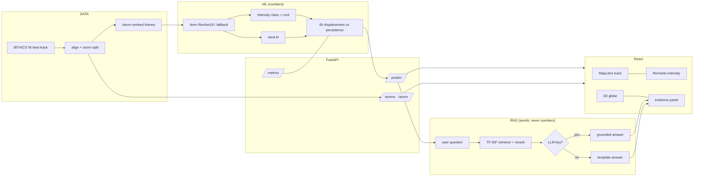

# 🌀 MEGH — Meteorological & Environmental Geospatial Hub

**Satellite intelligence for North Indian Ocean tropical cyclones — identify, classify, estimate, forecast, and explain.**

<p>
  
  
  
  
  
  
</p>

> **Team Vittvanni · SIH Problem Statement 26070.** Decision-support analysis on historical
> storms — ground truth: NOAA IBTrACS best-track. Not an official warning; always follow IMD advisories.

---

## ✨ What it does

| Step | Capability | Verified by |
|------|-----------|-------------|
| 🛰️ Observe | 30 real NI storms · 844 six-hourly fixes, storm-centred frames | `GET /storms` |
| 👁️ Identify | Cyclone pattern perception (timm ResNet18, numpy fallback live) | `/health → ml_backend` |
| 📊 Classify | IMD 7-class intensity + confidence | test macro-F1 **0.70** |
| 💨 Estimate | Sustained wind regression | test MAE **0.35 kt** |
| 🧭 Forecast | 6-hour movement vs persistence baseline | test **13.0 km** vs 12.7 km |
| 📚 Explain | FastAPI → Retriever → LLM (template fallback), cited sources | `POST /explain` |
| 🔐 Access | Server-side accounts: Viewer / Analyst / Researcher | `POST /auth/*` |

**Live demo flow:** open a storm → scrub the timeline → red MEGH-6h vs orange persistence vs green actual → ask *why* → read cited evidence.

---

## 🚀 Run it (2 terminals, from this folder)

```powershell
# 1 — backend + frontend build served on ONE port
cd D:\SIH26070\Project70\MEGH_SIH26070_Docs\MEGH
.\.venv\Scripts\python.exe -m uvicorn api.main:app --port 8000
# → UI: http://127.0.0.1:8000/dashboard   API docs: http://127.0.0.1:8000/docs
```

```powershell
# 2 — frontend dev (hot reload, proxies API to :8000)
cd D:\SIH26070\Project70\MEGH_SIH26070_Docs\MEGH\web
npm run dev
# → http://127.0.0.1:5173/dashboard
```

> `ModuleNotFoundError: No module named 'api'` → you started uvicorn from the wrong
> folder. `cd` into this folder first. `npm run dev` needs the backend on `:8000`,
> otherwise API calls return proxy 500s (the UI tells you this on-screen).

<details>
<summary><b>🧪 Reproduce the ML pipeline</b></summary>

```powershell
.\.venv\Scripts\python.exe -m training.prepare_dataset --input data/raw/ibtracs_ni.csv --n-storms 30
.\.venv\Scripts\python.exe -m training.train_classifier
.\.venv\Scripts\python.exe -m training.train_track
.\.venv\Scripts\python.exe -m training.evaluate
.\.venv\Scripts\python.exe -m pytest tests/ -q
.\.venv\Scripts\python.exe -m rag.ingest --rebuild
# PyTorch upgrade (CPU): .\.venv\Scripts\python.exe -m training.train_torch --epochs 5
# LLM grounding: set MEGH_LLM_URL + MEGH_LLM_KEY (+ optional MEGH_LLM_MODEL)
```

</details>

---

## 🏗️ Architecture



**Boundary (non-negotiable):** models predict numbers · retrieval explains with citations.
The LLM can never overwrite a wind, position, or metric.

---

## 🖥️ Pages

| Route | Who | What |
|-------|-----|------|
| `/dashboard` | Everyone | 3D globe with live genesis arcs, animated stats, pipeline, live charts |
| `/workspace` | Logged in | Role dashboard — Viewer mission control / Analyst verification / Researcher model card |
| `/cyclones` | Everyone | Searchable archive: name, lifecycle, peak class & wind |
| `/cyclone/:id` | Everyone | Replay, satellite frame, MEGH vs persistence vs actual, intensity chart, evidence |
| `/methodology` | Everyone | Pipeline + limits, stated plainly |
| `/login` `/signup` | — | Server-side sessions (PBKDF2 + expiring bearer tokens), 3 workspaces |

🌗 Light/dark toggle in the navbar — maps, charts and 3D follow the theme.

---

## 📡 API reference

| Method | Route | Purpose |
|--------|-------|---------|
| GET | `/health` | status + active `ml_backend` (`torch` or `numpy`) |
| GET | `/storms` | 30 storm summaries: lifecycle, genesis/peak coords, peak class |
| GET | `/storm/{id}` | summary + all fixes |
| POST | `/predict` | `{storm_id, timestamp?}` → class, confidence, wind, 6h, persistence, uncertainty |
| POST | `/explain` | `{question, prediction?}` → grounded answer + cited sources |
| GET | `/metrics` | held-out eval straight from checkpoints (drives the dashboards) |
| POST | `/auth/signup` `/auth/login` | `{name, password, role}` → `{token, user}` |
| GET | `/auth/me` · POST | `/auth/logout` — Bearer session verify / revoke |
| GET | `/frames/{file}` | satellite frame imagery |

---

## 🗂️ Repository

```
megh/
├── web/                  React + Vite + Tailwind + MapLibre + Recharts + three.js
│   └── src/{pages,components,api.js,auth.jsx,theme.jsx}
├── api/                  FastAPI: main, config, auth, services/{predict,rag_service}
├── models/               features, intensity, track (numpy) + torch_models (timm)
├── training/             ibtracs, prepare_dataset, train_classifier, train_track,
│                         train_torch, evaluate, imd scale
├── rag/                  sources/*.md (IMD/WMO/IBTrACS/MOSDAC/model card/data dict)
│                         ingest, retrieve, rerank, prompts
├── data/metadata/        dataset.csv (844 fixes, storm-level train/val/test)
├── models/checkpoints/   *.pkl + eval.json (tracked, tiny) · torch_*.pt when trained
├── app/                  Streamlit dashboard (legacy — React is the primary UI)
└── tests/                dataset leakage, checkpoints, API, RAG, auth (5 tests)
```

---

## 📊 Data & evaluation honesty

- **Labels:** NOAA NCEI IBTrACS v04r00, North Indian Ocean file — real storm names, positions, winds (New Delhi → USA → WMO preference), IMD 7-class mapping.
- **Frames:** deterministic synthetic proxies (`SYN_PROXY`) until HURSAT / INSAT-3D ingest — every observation carries its `satellite_source`, always visible.
- **Split:** whole storms held out (test: 6 storms, 141 rows) — adjacent fixes never leak across splits; `test_smoke` asserts zero storm overlap.
- **Track:** ridge ≈ persistence on real 6h fixes (13.0 vs 12.7 km). Reported as-is; the torch temporal model is the upgrade path, not a hidden tweak.
- **Wind MAE 0.35 kt** uses wind as an input feature — the vision-only ablation (macro-F1 0.72) shows true image skill.

---

## 🗺️ Roadmap

- [x] Real IBTrACS storms + retrained baselines
- [x] React product UI + roles + themes + 3D
- [x] Server-side auth + RAG with LLM hook
- [ ] Run `train_torch` → flip `ml_backend` to torch
- [ ] HURSAT / INSAT-3D frame ingest (retire SYN_PROXY)
- [ ] 12-hour horizon + calibrated uncertainty
- [ ] SSO for production identity

---

<p align="center"><b>MEGH</b> · Team Vittvanni · SIH26070 · <a href="http://127.0.0.1:8000/dashboard">live dashboard</a></p>
```

